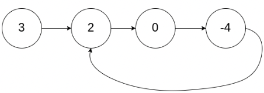
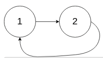

# Detect Cycle Start
Given the head of a linked list, return the node where the cycle begins. If there is no cycle, return null.

There is a cycle in a linked list if there is some node in the list that can be reached again by continuously following the next pointer. Internally, pos is used to denote the index of the node that tail's next pointer is connected to (0-indexed). It is -1 if there is no cycle. Note that pos is not passed as a parameter.

Do not modify the linked list.

**Example 1:**

```
Input: head = [3,2,0,-4], pos = 1
Output: tail connects to node index 1
Explanation: There is a cycle in the linked list, where tail connects to the second node.
```

**Example 2:**

```
Input: head = [1,2], pos = 0
Output: tail connects to node index 0
Explanation: There is a cycle in the linked list, where tail connects to the first node.
```

**Example 3:**
```
Input: head = [1], pos = -1
Output: no cycle
Explanation: There is no cycle in the linked list.
```

**Constraints:**
```
The number of the nodes in the list is in the range [0, 104].
-105 <= Node.val <= 105
pos is -1 or a valid index in the linked-list.
```

Follow up: Can you solve it using O(1) (i.e. constant) memory?

## Ideal Approach: *Use the Floyd Tortoise and Hare Algorithm*
Solve the problem in two steps:
1. Find the point of intersection using a two pointer approach.
1. Use the point of intersection to find the entrance of the loop using another two pointer approach.

Using two pointers, *p<sub>slow</sub>* and *p<sub>fast</sub>*, the following parts of a list with a cycle will be referenced in the solution:
1. There is a segment *AB* | the point A is the head of a list, and B is the entrance to a cycle *C*.
1. There is a segment *BX* | the point *X* is on the cycle.
1. There is a segment *XB* | *BX* + *XB* = *C*, the length of the cycle.

If *p<sub>fast</sub>* traverses the list at twice the rate of *p<sub>slow</sub>*, then the following statements are true:

1. The intersection will occur at a point *X* point on the cycle.
1. At point *X*, *p<sub>fast</sub>* will travel twice the distance of *p<sub>slow</sub>*.
1. Therefore,
`2 * (AB + BX) = AB + nC + BX`

Simplifying the equation yields:
`AB + BX = nC`.

Solving for *AB*:

`AB = nC - BX`.

The above equation suggests that if *p<sub>fast</sub>* starts at the intersection point *X*, it will intersect *p<sub>slow</sub>* at point *B*.

## Complexity Analysis
### Time Complexity
If a cycle is present, the solution requires two iterations of the list:
1. One iteration to find the intersection point *X* on the cycle: *__O(N + (n - 1)C + BX)__* &rarr; *__O(N)__*.
1. Another iteration to find the entrance of the cycle: *__O(AB)__* &rarr; *__O(N)__*.

### Space Complexity
Since no other containers are allocated to store results, the space complexity is *__O(1)__*.
