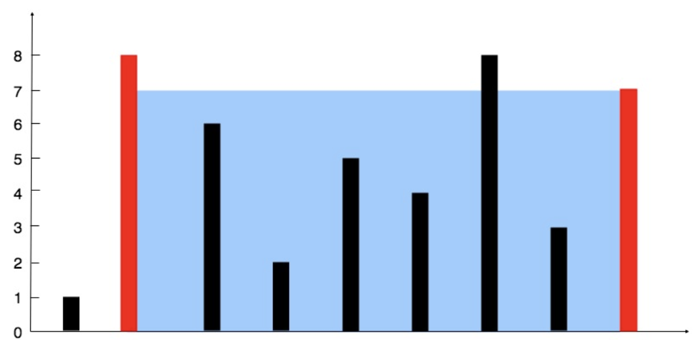

# Container with Most Water
You are given an integer array height of length n. There are n vertical lines drawn such that the two endpoints of the
ith line are (i, 0) and (i, height[i]).

Find two lines that together with the x-axis form a container, such that the container contains the most water.

Return the maximum amount of water a container can store.

Notice that you may not slant the container.


**Example 1:**


```
Input: height = [1,8,6,2,5,4,8,3,7]
Output: 49
Explanation: The above vertical lines are represented by array [1,8,6,2,5,4,8,3,7]. In this case, the max area of water
(blue section) the container can contain is 49.
```

**Example 2:**
```
Input: height = [1,1]
Output: 1
```

**Constraints:**
```
n == height.length
2 <= n <= 105
0 <= height[i] <= 104
```

## Implementation Notes
### Initial Approach
The initial approach follows the most optimal strategy, achieving *O(n)* runtime complexity.
#### **What to Notice**
1. This problem seeks to optimize the area of a 2D container.
1. The minimum height of the container's edges determines the effective height for holding water.
1. To solve this problem efficiently, the *x-dimension* must be constrained to its maximum value at the start of the
search algorithm &mdash; i.e. the size of the input array.
> *__NOTE__: In this problem the distance between elements is fixed to 1. Had this not been the case, the maximum width
> must be computed first.*

The algorithm subsequently performs the following steps:
1. Compute the area of the container using the outer most edges.
1. If the left edge is less than the current right edge, advance the left edge inward.
1. If the right edge is less than the current left edge, advance the right edge inward.
1. Compute the area of this reduced-width container. Set the maximum area to the new area iff the new area is greater
than the current maximum area.
1. Terminate the search when the new container width is less than 1.

## Optimizations
Further optimization attempts (reducing computation steps, ect.) proved in conclusive using the Leetcode platform. A
formal assessment of execution time performance was not done.

## For the Curious
### Problem Modifications
1. *What if there is a further optimization goal: minimize/maximize the containers footprint?*
    - To minimize the container footprint, the maximum area should be updated whenever the new area of the reduced-width
    container is greater than OR equal to the current maximum area.
    - To maximize the container footprint, only update the maximum area when the reduced-with container if greater than
    the current maximum area. This approach should have fewer assignments in a best case scenario.
1. *How would you handle the case where distances between height were random?*
    - In such a case, each distance would need to be summed at the start of the search.
    for each height (left or right), the distance to the next height would be fetched and subtracted from the current
    width.
