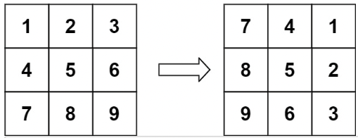
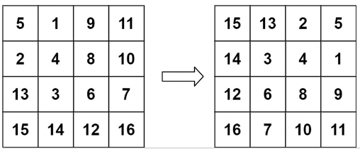

# Rotate Image
You are given an n x n 2D matrix representing an image, rotate the image by 90 degrees (clockwise).

You have to rotate the image **in-place**, which means you have to modify the input 2D matrix directly. DO NOT allocate another 2D matrix and do the rotation.


**Example 1:**</br>

```
Input: matrix = [[1,2,3],[4,5,6],[7,8,9]]
Output: [[7,4,1],[8,5,2],[9,6,3]]
```

**Example 2:**</br>

```
Input: matrix = [[5,1,9,11],[2,4,8,10],[13,3,6,7],[15,14,12,16]]
Output: [[15,13,2,5],[14,3,4,1],[12,6,8,9],[16,7,10,11]]
```

**Constraints:**
```
n == matrix.length == matrix[i].length
1 <= n <= 20
-1000 <= matrix[i][j] <= 1000
```

## Initial Approach
Look at a simple 3x3 matrix and document properties of the mapping between the input and output.

### Break the Transform in to Stages
1. Flip each row in the matrix **M**.
1. Perform a swap of all left-upper-triangle elements (*m<sub>ij</sub>*) with their bottom-right-triangle counter parts
(*m<sub>ij</sub>*).

## Complexity Analysis
### Time Complexity
The solution has two parts:
1. Flipping each row in the matrix: *__O(n * n/2)__* &rarr; *__O(n<sup>2</sup>)__*.
1. Swapping terms between the upper and lower triangles: *__O(n<sup>2</sup>/2)__* &rarr; *__O(n<sup>2</sup>)__*.

Taken together, this results in *__O(n<sup>2</sup>)__* time complexity.

### Space Complexity
All matrix operations are performed in place. This results in a space complexity of *__O(1)__* since no additional space is allocated for the result or temporary results.
