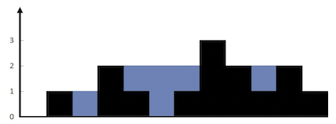

# Trapping Rain Water
Given n non-negative integers representing an elevation map where the width of each bar is 1, compute how much water it can trap after raining.

**Example 1:**


```
Input: height = [0,1,0,2,1,0,1,3,2,1,2,1]
Output: 6
Explanation: The above elevation map (black section) is represented by array [0,1,0,2,1,0,1,3,2,1,2,1]. In this case, 6 units of rain water (blue section) are being trapped.
```
**Example 2:**
```
Input: height = [4,2,0,3,2,5]
Output: 9
```

**Constraints:**
```
n == height.length
1 <= n <= 2 * 104
0 <= height[i] <= 105
```

## Initial Approach
> *__NOTE__: This idea extends a technique observed in
> [Container with Most Water](../container-with-most-water/README.md#what-to-notice).

### First Attempt (Unsuccessful Algorithm)
1. Starting from the beginning of the array, find the first non-zero height.
1. Initialize a total trapped water variable to zero
1. Initialize a temporary cumulative sum variable to zero.
1. For each remaining element:
    1. While the next height is `LT` the current:
        1. Compute the difference in height as the discrete amount of trapped water
        observed at that index.
        1. Add the difference to the temporary cumulative sum.
    1. If the next height is `GTE` to the current height:
        1. Add the temporary cumulative sum to the total trapped water.
        1. Reset the temporary cumulative sum to zero.

### Second Attempt (Successful Algorithm)
1. Initialize two pointers: one at the beginning of the array, the other at the tail.
1. Initialize the max height of the left and right sides of th array to the values at the beginning and tail
respectively.
1. Update the positions of the left and right pointers accordingly: ++left, --right.
1. While the left pointer position is `LTE` the right pointer position:
    1. If the current max left height is `LT` the current max right height, then the left side will limit the water's
    height. Search for a local minima on the left.
        1. If the height to the right is `LT` the current left max, calculate the amount of water it can hold and add it
        to the total sum of trapped water.
        1. Otherwise, update the maximum left height pointer to the current location of the left pointer.
        1. Update the left pointer: ++left;
    1. Otherwise, the max right height is `LTE` the current left height and the right side will limit the water's
    height. Search for a local minima on the right.
        1. If the height to the left is `LT` the current right max, calculate the amount of water it can hold and add it
        to the total sum of trapped water.
        1. Otherwise, update the maximum right height pointer to the current location of the right pointer.
        1. Update the right pointer: --right.

The solution is similar to [Container with Most Water](../container-with-most-water/README.md).
- Both algorithms search for a maxima and are dependent on a limiting factor: the min height.
- Both algorithms start at the ends of the array and work inwards. This property arises because of the existence of the min height limiting condition.
- Since the min height can be found on either the left of right side of the array, it needs to be evaluated on every loop iteration.


